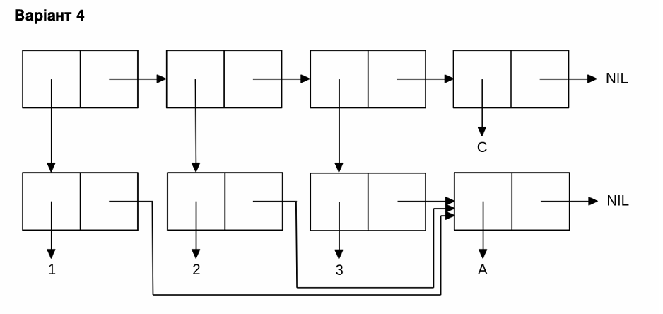

<p align="center"><b>МОНУ НТУУ КПІ ім. Ігоря Сікорського ФПМ СПіСКС</b></p>
<p align="center">
<b>Звіт з лабораторної роботи 1</b><br/>
"Обробка списків з використанням базових функцій"<br/>
дисципліни "Вступ до функціонального програмування"
</p>
<p align="right"><b>Студентка</b>: Ідолова А.П. група КВ-33</p>
<p align="right"><b>Рік</b>: 2026</p>

## Загальне завдання

1. Створіть список з п'яти елементів, використовуючи функції LIST і CONS. Форма
   створення списку має бути одна — використання SET чи SETQ (або інших
   допоміжних форм) для збереження проміжних значень не допускається. Загальна
   кількість елементів (включно з підсписками та їх елементами) не має
   перевищувати 10-12 шт. (дуже великий список робити не потрібно). Збережіть
   створений список у якусь змінну з SET або SETQ . Список має містити (напряму
   або у підсписках):
 - хоча б один символ
 - хоча б одне число
 - хоча б один не пустий підсписок
 - хоча б один пустий підсписок
2. Отримайте голову списку.
3. Отримайте хвіст списку.
4. Отримайте третій елемент списку.
5. Отримайте останній елемент списку.
6. Використайте предикати ATOM та LISTP на різних елементах списку (по 2-3
   приклади для кожної функції).
7. Використайте на елементах списку 2-3 інших предикати з розглянутих у розділі 4
   навчального посібника.
8. Об'єднайте створений список з одним із його непустих підсписків. Для цього
   використайте функцію APPEND.
   
```lisp
;; Пункт 1
CL-USER> ‌‌(set 'my_list (list 'a 4 (* 2 31) NIL (cons 'b (list 7)) ))
  
(A 4 62 NIL (B 7))

;; Пункт 2
CL-USER> ‌‌(car my_list)

A

;; Пункт 3
CL-USER> ‌‌(cdr my_list)
 
(4 62 NIL (B 7))

;; Пункт 4
CL-USER> ‌‌(third my_list)
 
62 (6 bits, #x3E, #o76, #b111110)

;; Пункт 5
‌‌CL-USER> (car(last my_list))
 
(B 7)

;; Пункт 6
CL-USER> ‌‌(atom (first my_list))
 
T

‌‌CL-USER> (atom (nth 3 my_list))
 
T‌‌

CL-USER> ‌‌(atom (car(last my_list)))
 
NIL

CL-USER> ‌‌(listp (first my_list))
 
NIL

CL-USER> ‌‌(listp (nth 4 my_list))
 
T

CL-USER> ‌‌‌‌(listp (car(last my_list)))
 
T

;; Пункт 7
CL-USER> ‌‌(evenp (second my_list))
 
T

CL-USER> ‌‌(plusp (third my_list))
 
T

CL-USER> ‌‌(= (third my_list) (second my_list))
 
NIL

‌‌CL-USER> (boundp (car my_list))
 
NIL


;; Пункт 8
CL-USER> ‌‌(append my_list (nth 4 my_list))
 
(A 4 62 NIL (B 7) B 7)

```
## Варіант 4
<p align="center">

</p>

```lisp

CL-USER> (let ((list_a (list 'a)))
   (list (cons 1 list_a)
       (cons 2 list_a)
       (cons 3 list_a)
       'c))
 
((1 A) (2 A) (3 A) C)

```